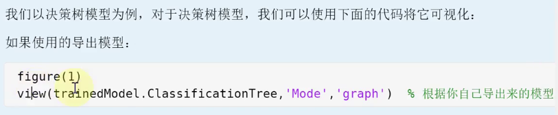
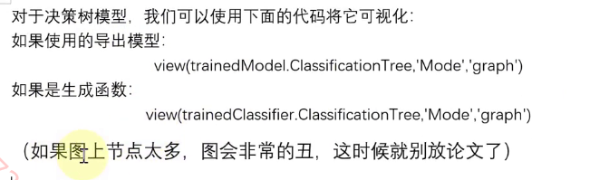
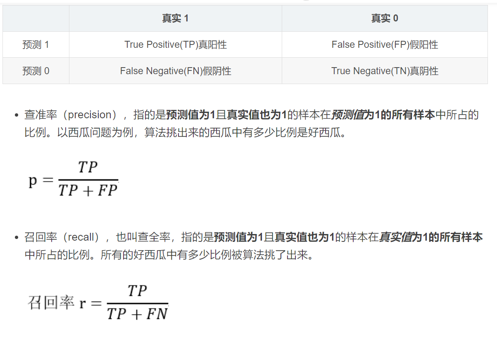
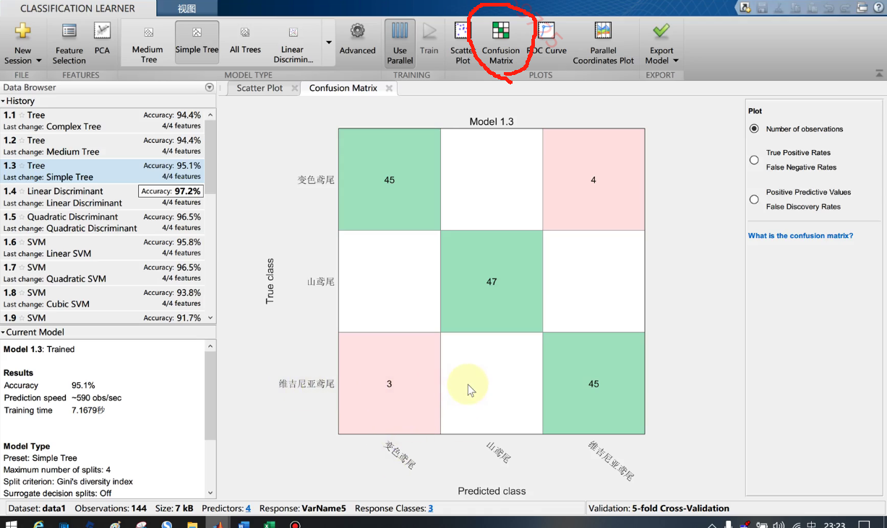
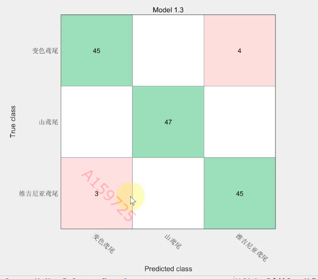

# Mathematics Modeling Note C-10
## SVM支持向量机（可用于分类或回归）
找到的分开两类的面为超平面  

线性支持向量机  
找到使得几何间隔（每个样本点到该超平面距离的最小值）最大的超平面  
现实情况中难以找到严格划分的超平面，引入松弛变量

非线性支持向量机  
利用非线性该模型分类  
 
核函数： 

给定核函数，就可以通过解线性支持向量机的方法求解非线性超平面  

  

## 集成学习
通过在数据上构建多个模型，集成所有模型结果  
集成学习大致分为两类：提升法(存在强依赖关系)（Boosting）（Adboost自适应提升算法，GBDT梯度提升决策树，Xgboost极端梯度提升），装袋法（不存在强依赖关系）（Bagging/Bootstrap aggregating） 

  

## KNN
如果特征空间中某未知样本距离最近的K个样本大多数样本属于同一类，则该未知样本也属于这一类  

***MATLAB导出代码生成函数需要修改！！！！！不能直接用***  

决策树可视化  
  
  

## F1分数 
F1 score用于衡量二分类问题模型精度，模型准确率与召回率的加权平均，[0, 1],数值越大模型越好  
  

$F_1=2\cdot\frac{Precision\cdot Recall}{Precision + Recall}$  
$F_\beta=(1+\beta)^2\frac{Precision\cdot Recall}{(\beta^2\cdot Precision)+Recall}$  

Macro-F1和Micro-F1  

Macro-F1和Micro-F1是相对于多标签分类而言的。  
Micro-F1，计算出所有类别总的Precision和Recall，然后计算F1。  
Macro-F1，计算出每一个类的Precison和Recall后计算F1，最后将F1平均。  

看懂混淆矩阵  
  

   
白色表示预测成此类的0个  

多分类问题的F1分数：Micro F1和Macro F1  
Micro F1：每一类指定为正类时TP,FP,FN相加，算总的F1；考虑到每个类别的数量，适用于各个类别数量差异大的情况，减小各个类别数量不均的影响  
Macro F1: 算每一类指定为正类时F1平均数；或者算每一类的Precision与Recall再计算F1,然后求平均  
若数据极度不平衡，可以单独汇报重要的类的F1  

