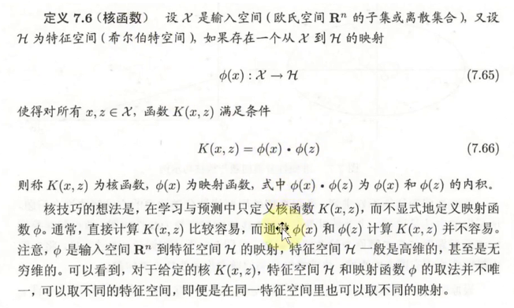
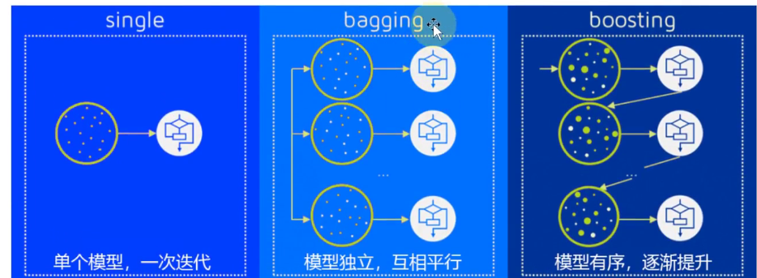

# Mathematics Modeling Note C-10
## SVM支持向量机（可用于分类或回归）
找到的分开两类的面为超平面  

线性支持向量机  
找到使得几何间隔（每个样本点到该超平面距离的最小值）最大的超平面  
现实情况中难以找到严格划分的超平面，引入松弛变量

非线性支持向量机  
利用非线性该模型分类  
 
核函数： 

给定核函数，就可以通过解线性支持向量机的方法求解非线性超平面  

  

## 集成学习
通过在数据上构建多个模型，集成所有模型结果  
集成学习大致分为两类：提升法(存在强依赖关系)（Boosting）（Adboost自适应提升算法，GBDT梯度提升决策树，Xgboost极端梯度提升），装袋法（不存在强依赖关系）（Bagging/Bootstrap aggregating） 

  

## KNN
如果特征空间中某未知样本距离最近的K个样本大多数样本属于同一类，则该未知样本也属于这一类  
