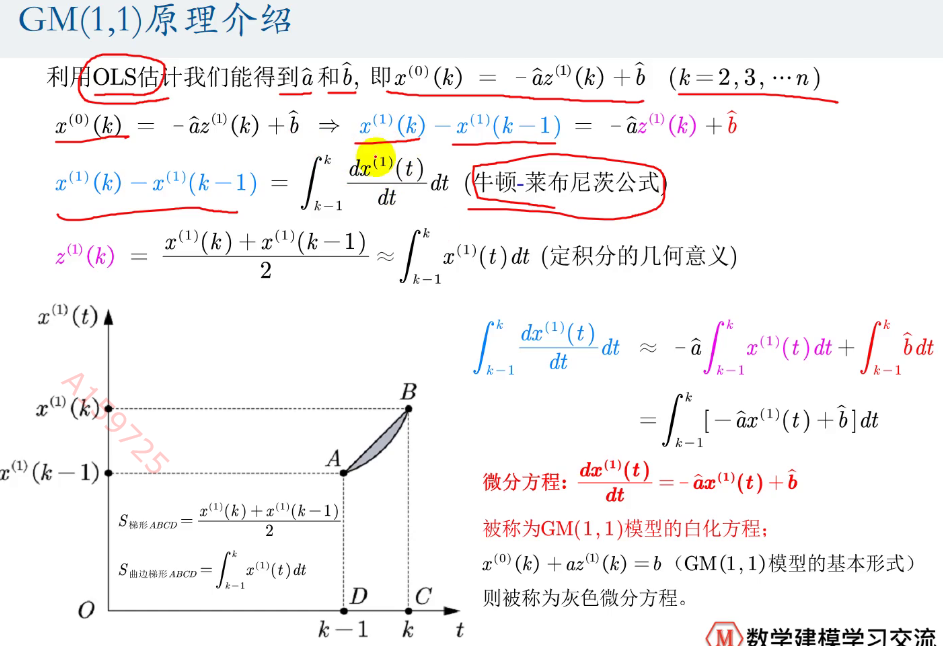
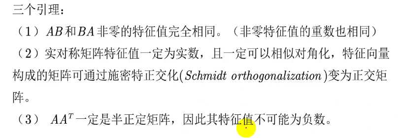

# Mathematics Modeling Note C-11
## BP神经网络
没看

## 灰色预测模型
对含有已知信息与不确定信息的系统(少量不完全信息)进行预测，  
***对在一定范围内变化，与时间有关的灰色过程预测***  
***处理小样本预测***  
时间序列短，统计数据少，信息不完全  

对原始数据进行生成处理以寻找系统变动规律，并生成具有较强规律性的数据序列，然后建立相应的微分方程模型，进而预测  

GM(1,1)Grey Model  
！！！处理原始离散非负数据列  
第一个1表示微分方程是一阶的，第二个1表示只有一个变量  
通过一次累加生成削弱随机性的较有规律的新离散数据列  
建立微分方程模型，得到离散点出的解经过累减生成的原始数据近似估计值，进而预测原始数据后续发展  

灰色生成：将原始数据列中的数据按某种要求进行数据处理称为数据生成  
常见的灰色系统生成方法有：累加生成，累减生成，均值生成，级比生成  

累加生成：通过数列间各个时刻数据依次累加得到新的数据与新的生成数列  
$x^{(1)}(i)=\sum_{j=1}^{i}x^{(0)}(j), i=1,2,\cdots,n$  
累加生成使得灰色过程由灰变白  

累减生成：$y(i)=x(i)-x(i-1)$  

均值生成：$y(i)=ax(i)-(1-a)x(i-1)$  

steps:  
1. X=(x(1), x(2), $\cdots$, x(n)),级比L(k)=x(k-1)/x(k), 若$e^{\frac{-2}{n+1}}< L(k)< e^{\frac{2}{n+1}}$,则认为可以建立较好的GM(1,1)模型  
2. 新的累加生成序列Y  
3. 对Y进行邻均值生成，$Z(k)=(\alpha X(k)+(1-\alpha)X(k+1))/2,k=2,3,\cdots,n,\alpha=0.5$  
$Z=(Z(2),Z(3),Z(4),\cdots,Z(n))$  
4. 构造数据矩阵B与数据向量Y  
$B=\begin{bmatrix}
Z(2) \\
Z(3) \\
\cdots \\
Z(n)
\end{bmatrix}  \\  
=\begin{bmatrix}
-\frac{1}{2}(z^{(1)}(1)+z^{(1)}(2)) & 1 \\
-\frac{1}{2}(z^{(1)}(2)+z^{(1)}(3)) & 1 \\
\ldots & \ldots \\
-\frac{1}{2}(z^{(1)}(n-1)+z^{(1)}(n)) & 1
\end{bmatrix},  \\
Y=\begin{bmatrix}
x^{(0)}(2) \\
x^{(0)}(3) \\
\cdots \\
x^{(0)}(n)
\end{bmatrix}$  
5. 计算发展系数a与灰作用量b，$\begin{bmatrix}a \\ b\end{bmatrix}=(B^T*B)^{-1}B^TY$  
6. $x^{(0)}(k)+az^{(1)}(k)=b$为GM(1,1)模型的基本形式,k=2,3,$\cdots$,n  
$x^{(0)}(k)=-az^{(1)}(k)+b->y=kx+b$  
7. 回归: $\widehat{a},\widehat{b}=argmin_{a, b}\sum_{i=1}^{n}(y_i-\widehat{y_i})^2$  
8. GM(1,1)模型的白化方程：$\frac{dx^{(1)}(t)}{dt}=-ax^{(1)}(t)+b$  

  

  

  

  

let $\beta=\begin{bmatrix}a \\ b\end{bmatrix}$  

$Y-\beta X=\begin{bmatrix}u_i\end{bmatrix},i=2,3,4,\cdots,n$   

$\begin{bmatrix}a \\ b\end{bmatrix}=(X^TX)^{-1}X^TY$  

多重共线性问题  
  
没看懂  

  


累加几次？准指数规律检验  
  
根据级比限定k的范围  

灰色预测模型的应用范围  
  
发展系数就是a，b是灰色作用量  

灰色预测模型的检验  
  

  

灰色预测模型微分方程另一种形式  
 
GM(1,1)模型的拓展：
  

什么时候用灰色预测模型？  
  

预测类题目的一些套路：  

## SVD与图形处理 
奇异值分解的三个引理  
一种矩阵分解的方法  
$A_{m\times n}=U_{m\times m}\sum_{m\times n}V^T_{n\times n}$  

其中$U,V$都为正交矩阵，$\sum$为奇异值矩阵  
$\sum_{m\times n}$只有主对角线上的元素不是零，对角元素称为奇异值，其他值为0  

SVD分解步骤  
1. 计算$U_{m\times m}$:
$AA^T$为m阶对称矩阵，对$AA^T$相似对角化，$AA^T=U\Lambda_1 U^T$，其中$AA^T$为对称矩阵  
2. 计算$V_{n\times n}$:  
对$A^TA$相似对角化，$A^TA=V\Lambda_2V^T$,得到正交矩阵$V$  
3. 求解$\sum$  
$AA^T$一定是半正定矩阵，因此特征值不可能是负数   
$\sum$对角元素就是$AA^T$的特征值开方，再从小到大填充  
 
**似乎在这里正交矩阵不对称**  
  

SVD证明思路  
  

利用SVD使得矩阵的秩减少，  

保留原始矩阵的特征比例 

减去某些奇异值  
帮助对数据进行压缩  

```MATLAB
[U,S,V]=svd(A)
```
**要复原的话，记得转置**  
**去除某个奇异值之后，相应的V的行数也要去除**  

奇异矩阵压缩比例就是压缩之后的矩阵奇异值之和除以原矩阵奇异值之和  

定义奇异矩阵压缩：  
```MATLAB
function [conpass_A]=mysvd(A, ratio)
[U,S,V]=svd(A);
eigs=diag(S);
SUM=sum(eigs);
temp=0;
for i=1:length(eigs)
    temp=temp+eigs(i)
    if(temp/SUM)>ratio
        break
    end
end
disp(num2str(roundn(100*temp/SUM, -2)),'%')
```

```MATLAB
function [compassed_A]=mysvd(A, ratio)
[U,S,V]=svd(A);
eigs=diag(S);
SUM=sum
temp=0;
for i=1:length(eigs)
    temp=temp+eigs(i);
    if temp > SUM*ratio
        break
    end
end
compassed_A=U(:, 1:i)*S(1:i, 1:i)*V(1:i, :);
disp(roundn(sum(diag(svd(compassed_A)(2))))/SUM, -2) %返回小数点后两位四舍五入的值
```  
SVD处理图片代码  
没看完   
不想看  
烦  

## 主成分分析
将多个变量划为少数几个综合指标的统计分析方法  
降维：将高维度数据保留下最重要的特征，去除噪声和不重要特征    

  

  


## LSTM


