# Mathematics Modeling Note C-3
## 回归分析（研究相关性!=因果性） 

1. 识别重要变量，去除不重要变量  
2. 判断相关性方向（正或负）
3. 计算权重(回归系数：不同变量之间相对重要性)  

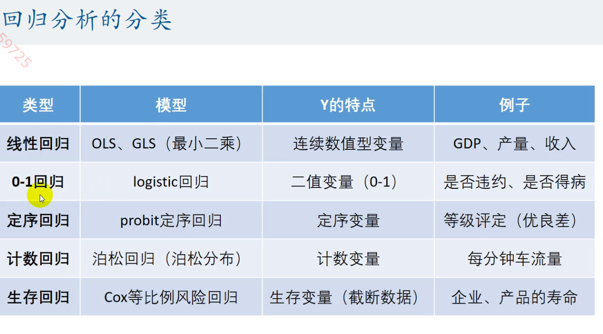

### 多元线性回归
------
不同类型数据处理方法  
  
***数据收集***   
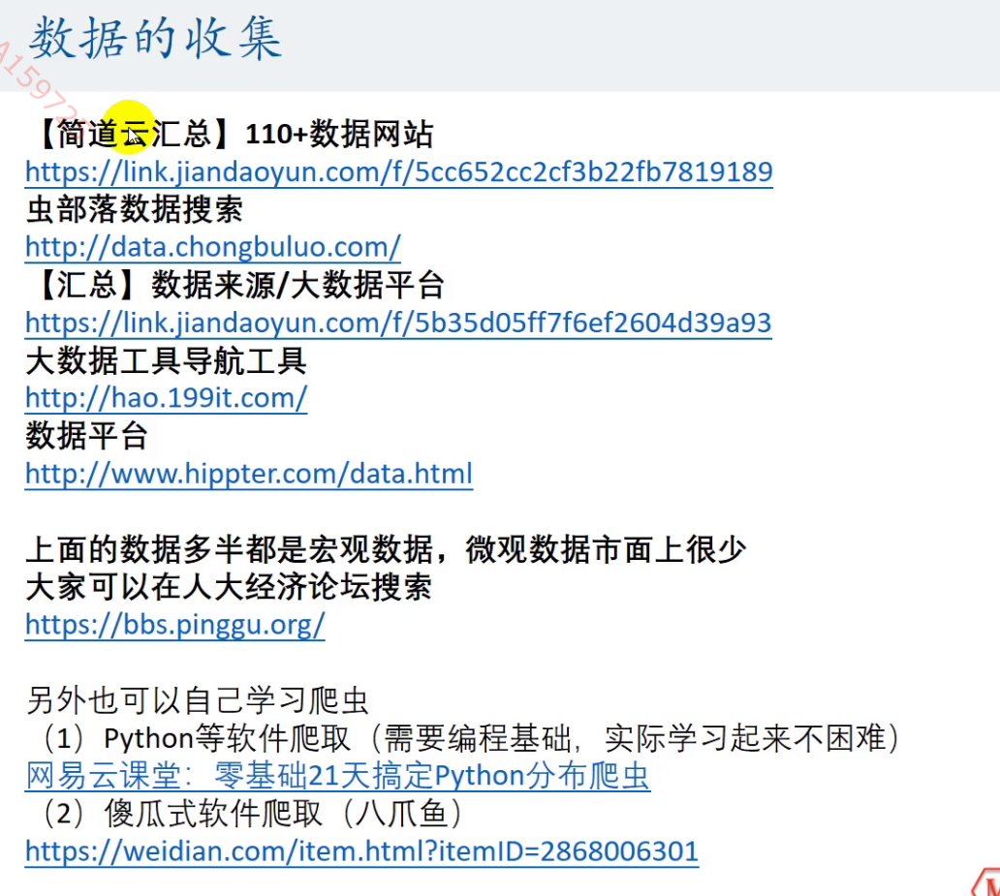  

一元线性回归  
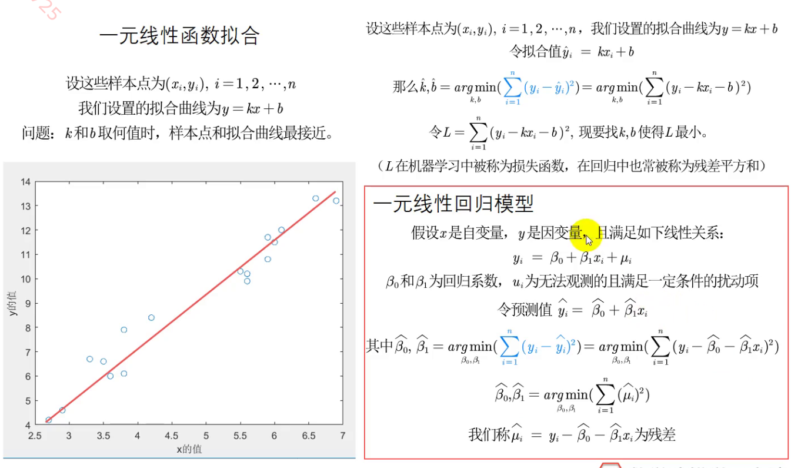 
$\eta_i$：扰动项     
$y_i$ = $\beta_0$ + $\beta_1x_i$+$\eta_i$    
回归系数：$\beta_0$, $\beta_1$  
$y_i$ = $\beta_0$ + $\beta_1x_i$+$\beta_2x_2$+$\eta_i$   
但两式$\beta_0$和$\beta_0$相差非常多————遗漏变量导致的内生性   
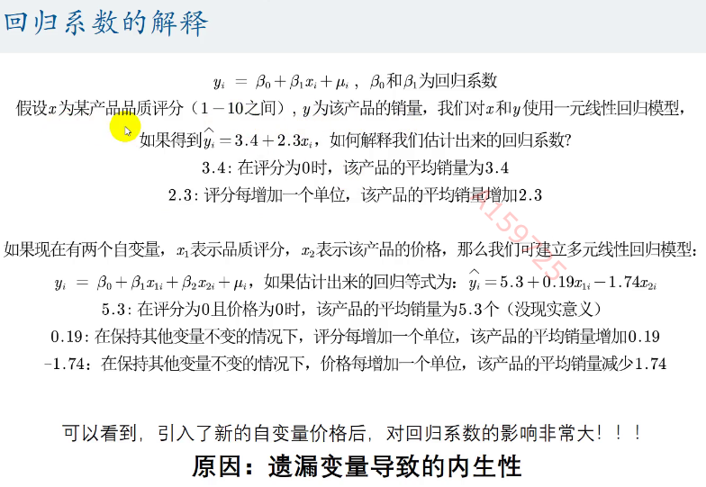   
外生性：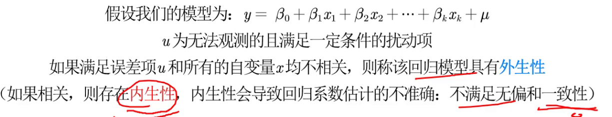
$\eta_i$包含了所有与y相关但未被添加到回归模型中的变量   
若$\eta_i$与已添加的自变量相关，则有内生性    
若$\eta_i$与所有已添加的自变量无关，则有外生性   
\
最小二乘法: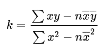  
\
***弱化外生性要求***
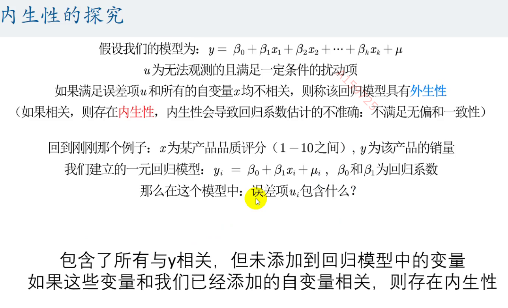  
\
$y_i$=$\widehat{\beta_0}$+$\widehat{\beta_1}x_{1i}$+$\cdots$+$\widehat{\beta_k}x_{ki}$  
回归系数(偏回归系数)：$\widehat{\beta_m}$=$\frac{\partial{y_i}}{\partial{x_mi}}$   
取对数的经验法则：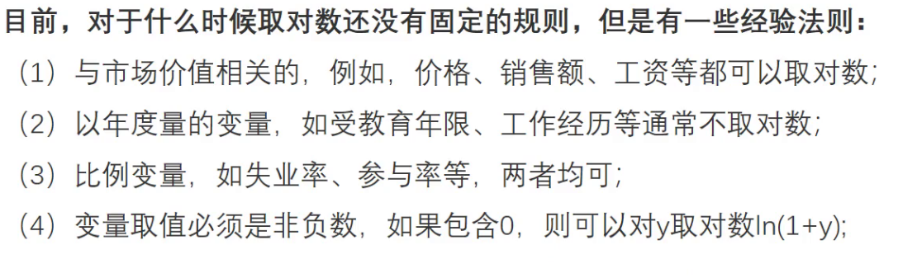   
回归系数的解释：  
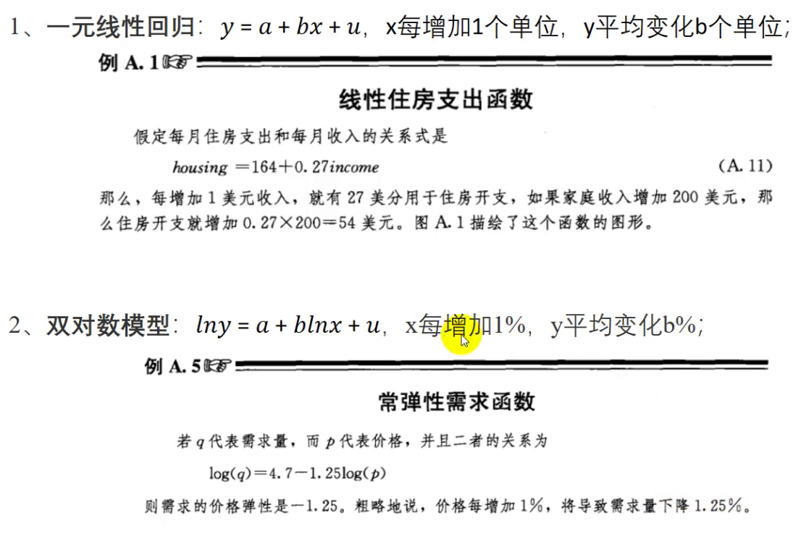   
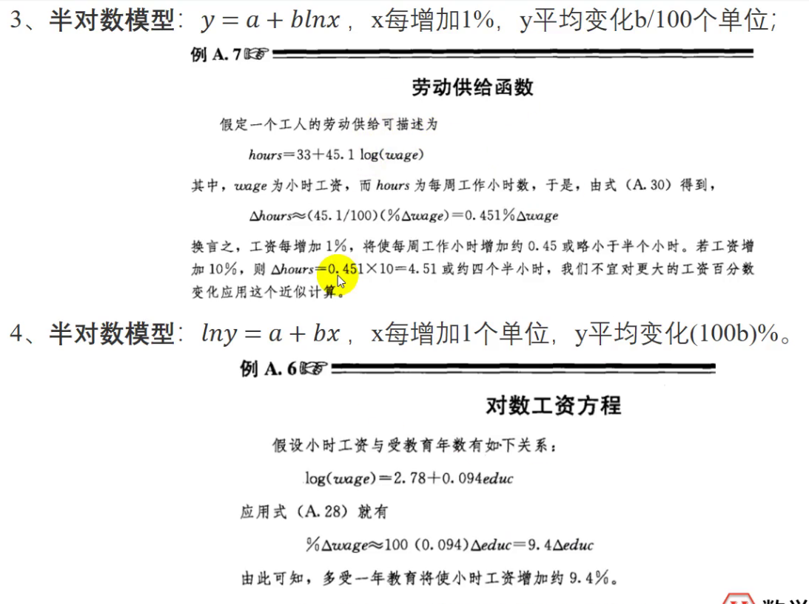   
\
对于定性变量，视为虚拟变量  
$y_i$=$\delta_0Female_i$+$\beta_0$+$\beta_1x_{1i}$+$\cdots$+$\beta_kx_{ki}$+$\eta_i$   
核心解释：$Female_i$  
控制变量：$x_m$  

多分类的虚拟变量  
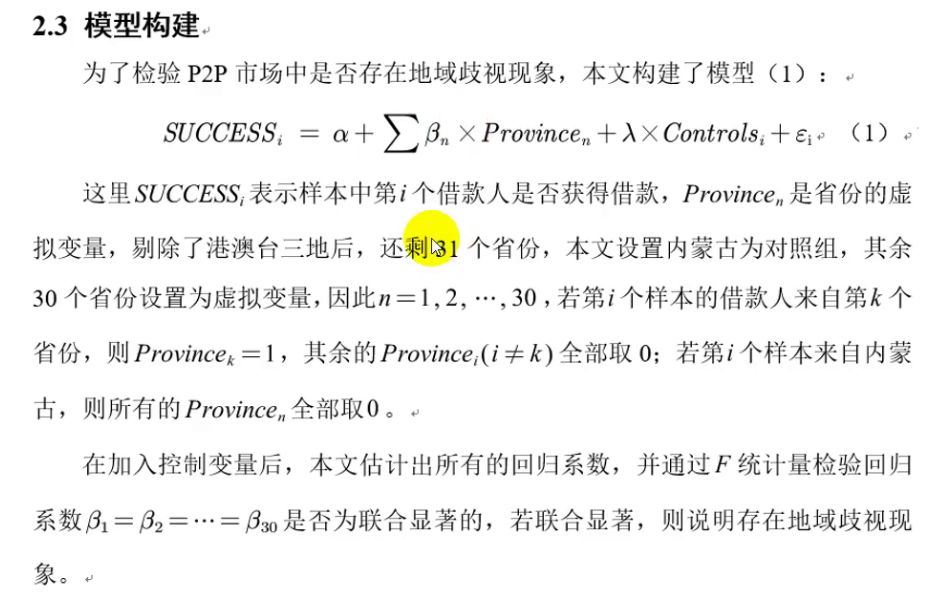  
注意！！31个省份，30个$Province_i$  
为了避免完全多重共线性的影响，虚拟变量个数为分类数-1   
例如，当样本来自内蒙古时，所有虚拟变量$Province_i$都取0；否则$Province_k$=1   
\
互为交互项的自变量   
$y_i$=$\beta_0$+$\beta_1x_{1i}$+$\cdots$+$\beta_kx_{ki}$  
若$\frac{\partial{y_i}}{\partial{x_mi}}$=$\beta_m$+$\beta_nx_{ni}$， 则$x_{mi}$与$x_{ni}$存在交互效应  

