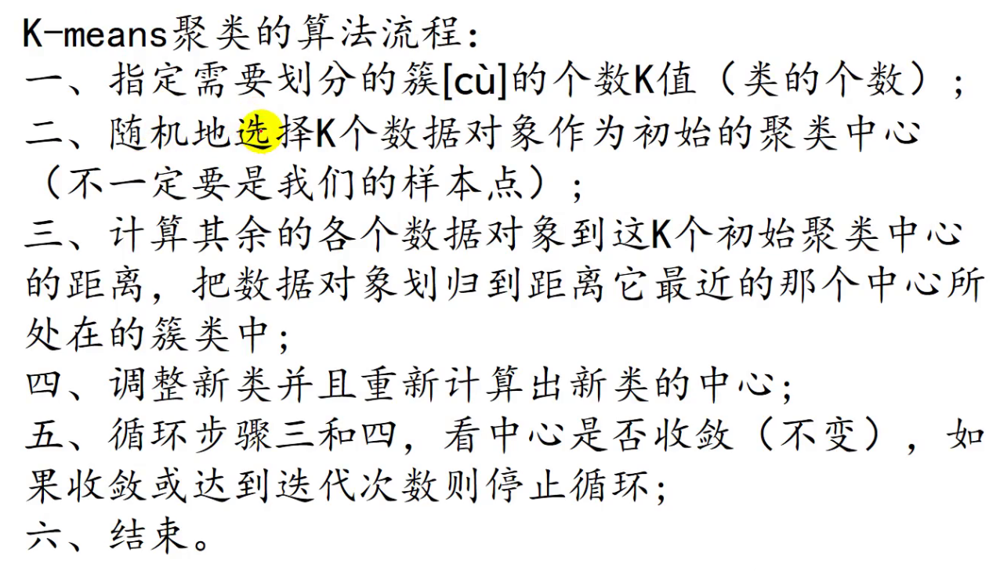
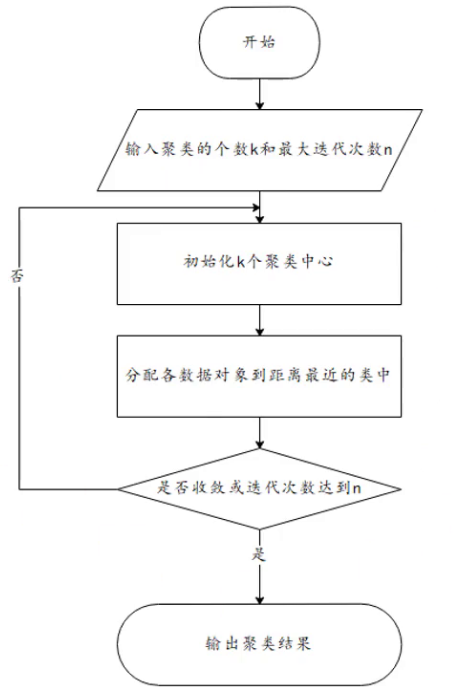
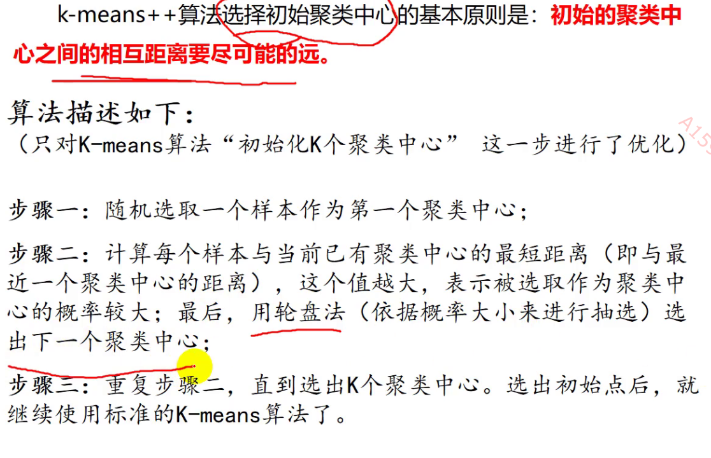
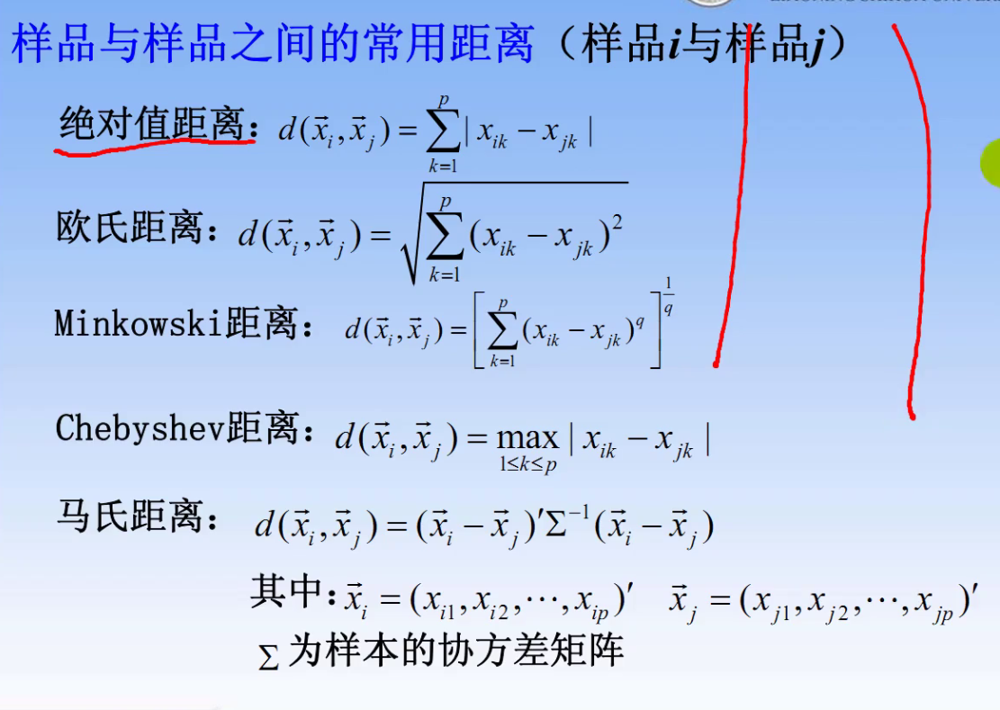
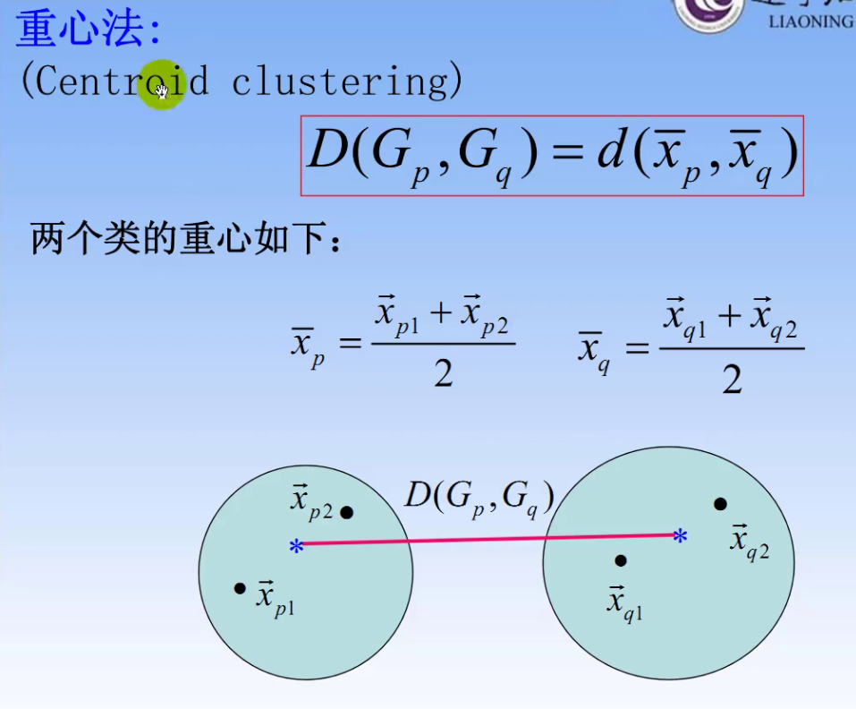
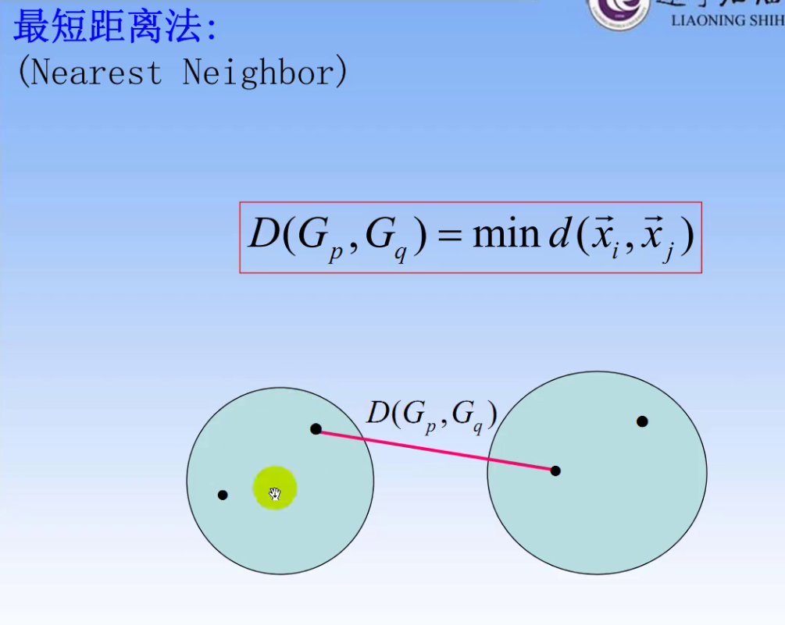
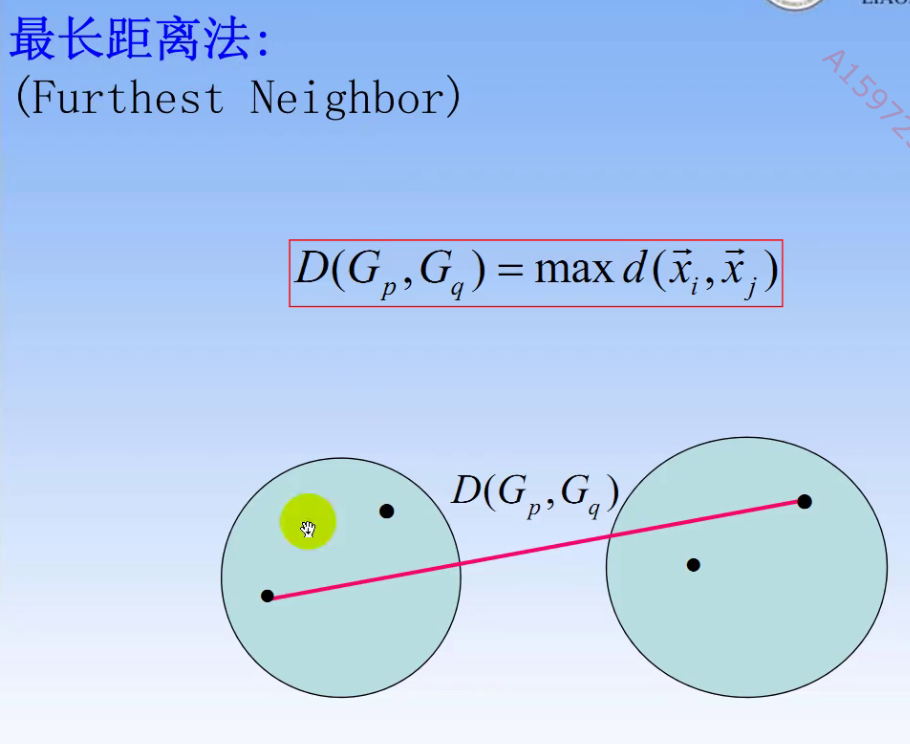
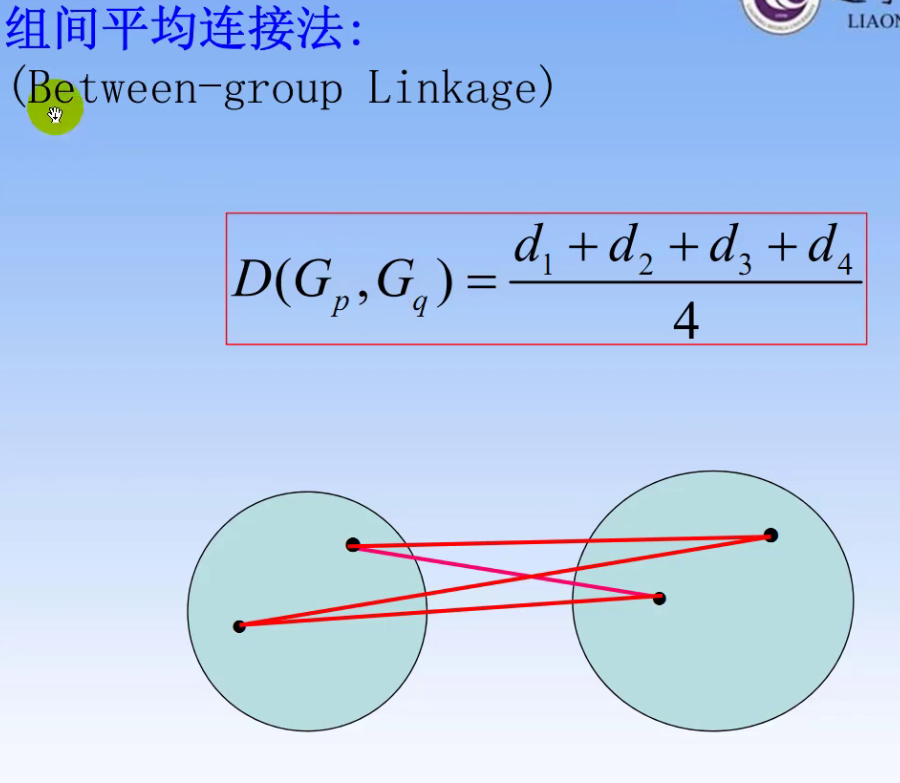

# Mathematics Modeling Note C-4
## 聚类模型 SPSS!!!!!
***聚类：类别未知，分类后可对每一类单独采用不同模型进行分析*** 
### K-means聚类算法
   
1. 确定k值
2. 随机选定初始中心点
3. 划分
4. 调整划分之后的新类并确定新类中心点
5. 若收敛或达到迭代次数则停止  

流程图  
缺点：必须事先给出k；对初值敏感；对孤立点敏感   
优点：简单快速；处理大数据集效率高   
解决方案———— K—means++（优化了选择初始聚类中心的不便）  
选择初始聚类中心原则：初始聚类中心之间距离要尽可能远
   

消除量纲影响————标准化   
\
样本之间的距离：  
  
类与类之间的距离：  
  
  
  
   
\
系统聚类流程图
   
1. 写出欧氏距离矩阵$D$
2. 每个样品视作一类，寻找最短距离，生成新类，计算新的距离矩阵$D_1$  
3. 不断得到新类，计算新的距离矩阵，直至达到迭代次数或者类的个数达到要求  

