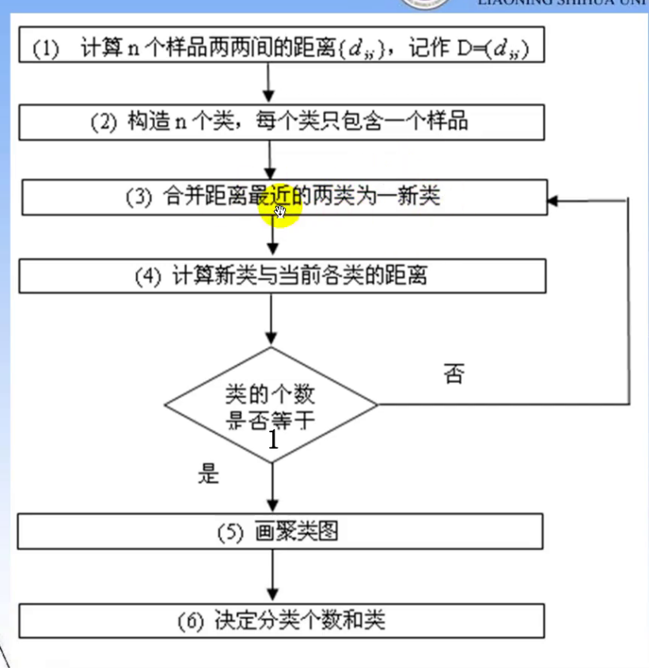
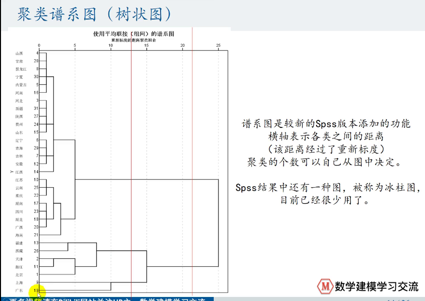
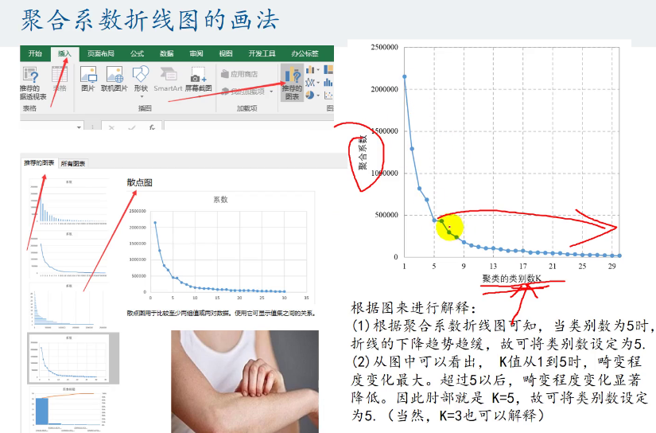
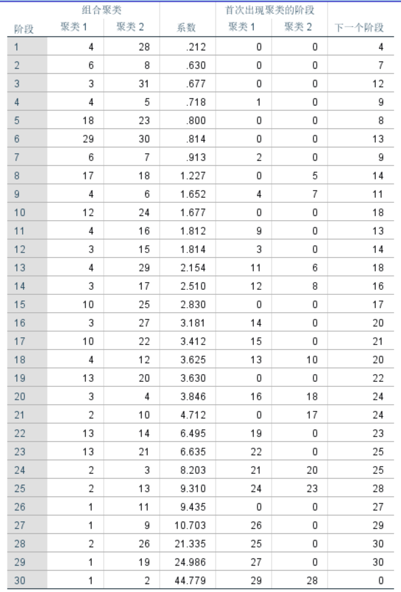
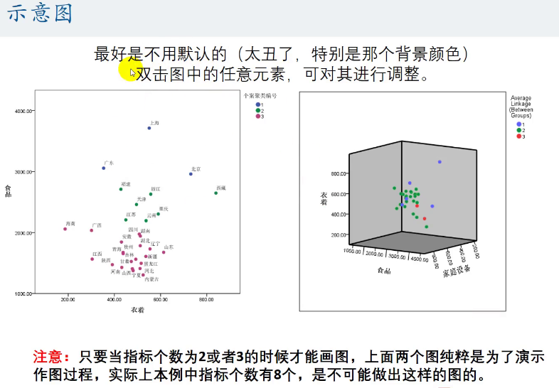

# Mathematics Modeling Note C-4
## 聚类模型 SPSS!!!!!
***聚类：类别未知，分类后可对每一类单独采用不同模型进行分析*** 
### K-means聚类算法  
-----  
   
1. 确定k值
2. 随机选定初始中心点
3. 划分
4. 调整划分之后的新类并确定新类中心点
5. 若收敛或达到迭代次数则停止  

流程图  
缺点：必须事先给出k；对初值敏感；对孤立点敏感   
优点：简单快速；处理大数据集效率高   
解决方案———— K—means++（优化了选择初始聚类中心的不便）  
选择初始聚类中心原则：初始聚类中心之间距离要尽可能远
   

消除量纲影响————标准化   
Z标准化：减去均值除以标准差  
### 系统聚类算法 
------
\
样本之间的距离：  
  
类与类之间的距离：  
  
  
  
   
\
系统聚类流程图
   
1. 写出欧氏距离矩阵$D$
2. 每个样品视作一类，寻找最短距离，生成新类，计算新的距离矩阵$D_1$  
3. 不断得到新类，计算新的距离矩阵，直至达到迭代次数或者类的个数达到要求  

将n个样本划分到K个类中  
记各个类的重心为$u_i$, 则每一个类$C_k$的畸变程度为到重心距离平方和$|x_i-u_k|^2$  
总畸变程度（聚合系数）：$J=\sum_{k=1}^{K}\sum_{i\in C_k}|x_i-u_k|^2$  
肘部法则：通过图形估计出最优的聚类数量   
  
***SPSS系统聚类结果分析***  

阶段1-30：从合并2类到只剩1类  
作图：

### DBSCAN聚类算法(具有噪声的基于密度的聚类算法)
-----
基于密度的聚类算法，不需要事先指定k值  
要求聚类空间中一定区域所包含对象不少于某一值    
能够在具有噪声的空间数据库中形成任意形状的簇，将密度足够大的区域相连接，*可处理异常数据*  
