# Mathematics Modeling Note C-5
***prophet与LSTM***  

时期时间序列数据， 例如每年GDP，可相加   
时点时间序列数据，例如每个时刻的身高，不可相加   
（灰色预测模型中有相加————局限性————只可预测时期时间序列？）  
长期趋势T;季节趋势S;循环变动C;不规则变动（扰动项）I  

！！！  
1. 只有当数据具有周期性时才进行时间序列分解  
2. 若随着时间的推移季节波动越来越大，则建议使用乘积模型；若波动恒定，则可以使用叠加模型；**若不存在季节波动，则两种模型都可以使用**  
例如：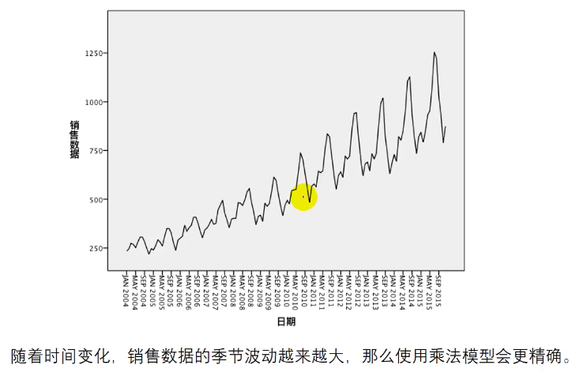

叠加模型(相互独立)：Y=T+S+C+I  
乘积模型(相互影响)：Y=T\*S\*C\*I   
Y:指标数据最终变动  

利用SPSS补全时序数据缺失值
-----
1. 开头或尾部：直接删除
2. 中间值：不可删除，替换
3. 序列平均值，临近点平均值或中位数，线性插值(两个点平均值)，线性趋势

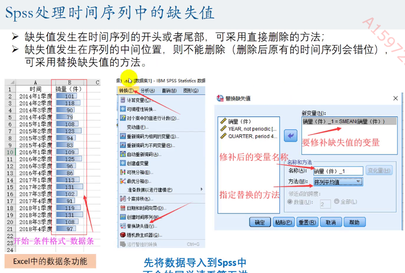

利用SPSS定义时间变量
-----
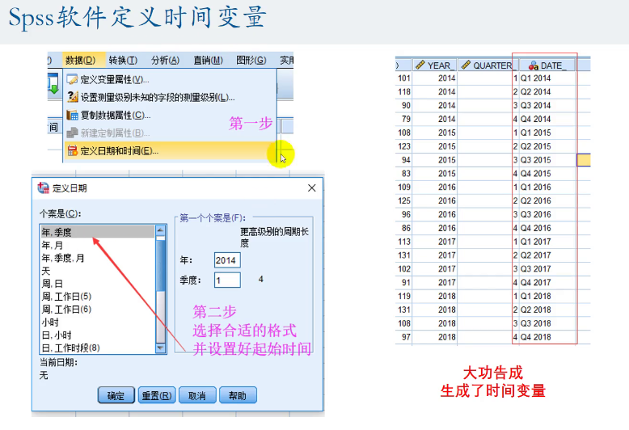
画时序图
-----
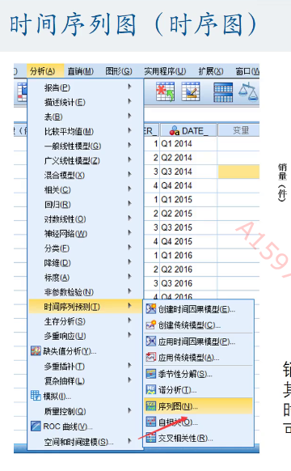
## 季节性分解  
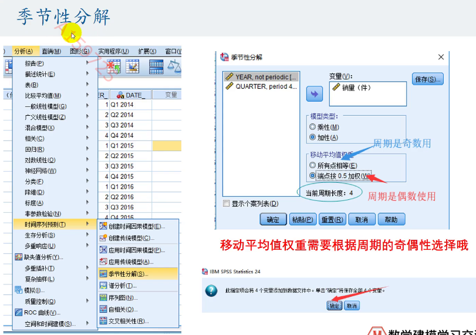  

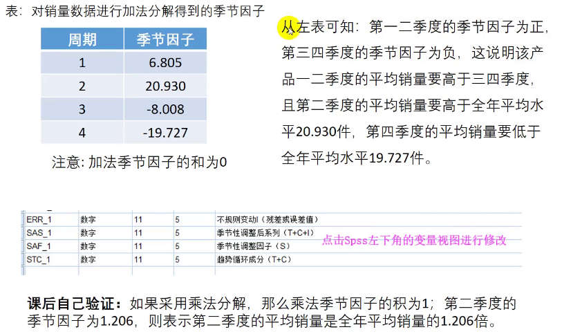
**季节性因子SAF:S**  
季节性调整后序列SAS：T+C+I  
趋势循环成分STC：T+C  
不规则变动ERR:I  

乘法分解：季节因子积为1  

时序分解步骤：
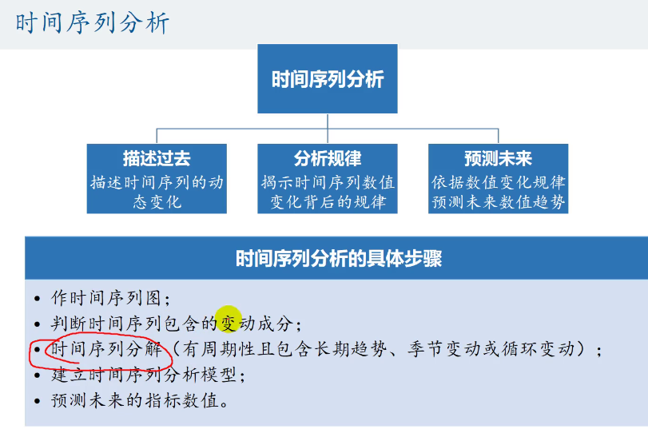 

***SPSS时序预测自动选取最合适的模型***  

## 指数平滑方法
### 简单指数平滑模型（不含趋势与季节成分）
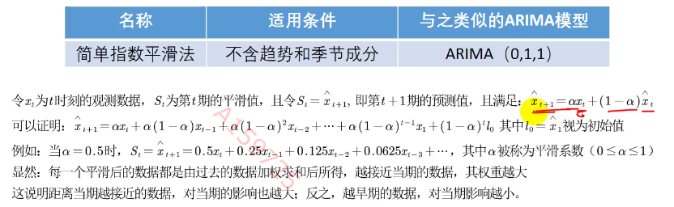  
$x_t$为t时期观测数据， $S_t=\widehat{x_{t+1}}$为t时期平滑值,即t+1时期的预测值，且$\widehat{x_{t+1}}=\alpha x_t+(1-\alpha)\widehat{x_t}$  
$\widehat{x_{t+1}}=\alpha x_t +\alpha(1-\alpha)x_{t-1}+\cdots+\alpha(1-\alpha)^{t-1}x_1+\alpha(1-\alpha)^{t}\widehat{x_1}$,其中$l_0=\widehat{x_1}$为初始值，$\alpha(0<\alpha<1)$为平滑系数   

$\alpha$选取原则；若时间序列数据有明显变化倾向，$0.3<\alpha<0.5$, 取较大值；  
若变化缓慢，取较小值$0.1<\alpha<0.4$;   
若长期趋势接近稳定常数，则$\alpha$值较小，$0.02<\alpha<0.05$;  

### 霍氏（Holt）线性趋势模型（线性趋势，不含季节成分，简单指数平滑模型的延伸）
$\begin{cases}
l_t=\alpha x_t+(1-\alpha)(l_{t-1}+b_{t-1})  (水平平滑方程)
\\
b_t=\beta(l_t-l_{t-1})+(1-\beta)b_{t-1}    (趋势平滑方程)
\\
\widehat{x_{t+h}}=l_t+hb_t,h=1,2,\cdots(预测方程)
\end{cases}$  
h：预测步长，即超前期数  
$b_t$:时刻t的预测趋势  
$\alpha$:水平平滑参数  
$\beta$:趋势平滑参数  
### 阻尼趋势模型（线性趋势逐渐减弱，不含季节成分）
$\begin{cases}
l_t=\alpha x_t+(1-\alpha)(l_{t-1}+\phi b_{t-1})  (水平平滑方程)
\\
b_t=\beta(l_t-l_{t-1})+(1-\beta)\phi b_{t-1}    (趋势平滑方程)
\\
\widehat{x_{t+h}}=l_t+(1+\phi+\phi^2 +\phi^3+\cdots+\phi^h)b_t,h=1,2,\cdots(预测方程)
\end{cases}$  
h：预测步长，即超前期数  
$b_t$:时刻t的预测趋势  
$\alpha$:水平平滑参数  
$\beta$:趋势平滑参数  
若$\phi=1$,则阻尼趋势模型为霍氏线性趋势模型  
### 简单季节性（不含趋势，含稳定季节成分）
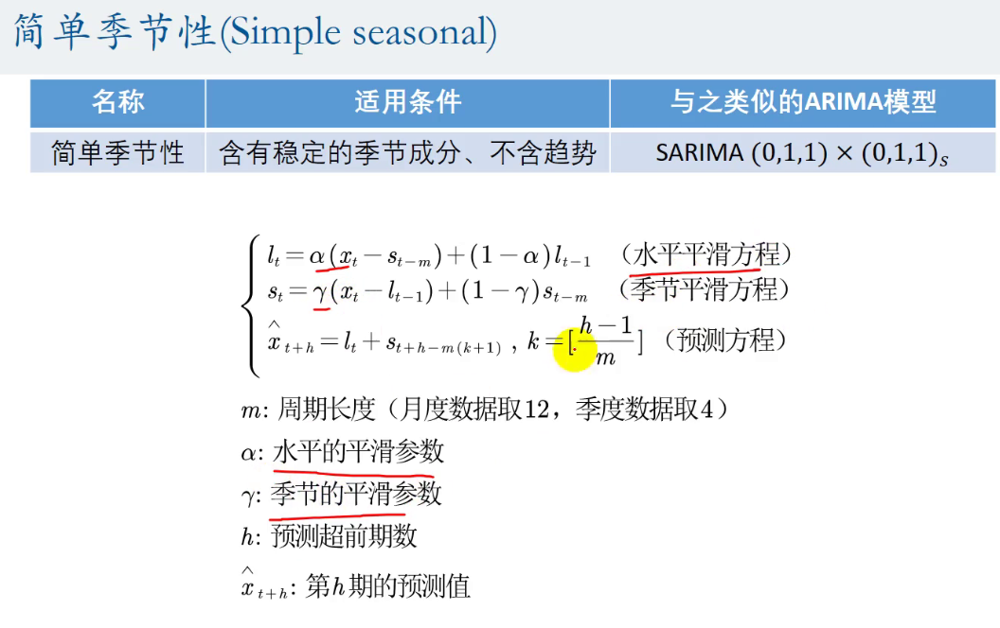
### 温特加法模型（含线性趋势，含稳定季节成分）
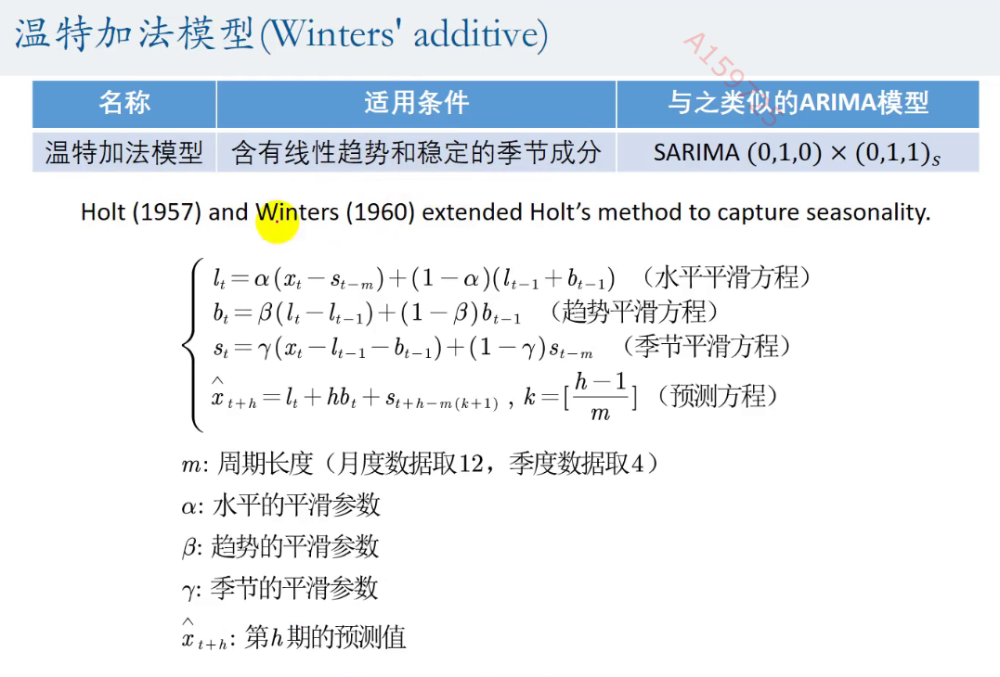
### 温特乘法模型（含线性趋势，含不稳定季节成分）
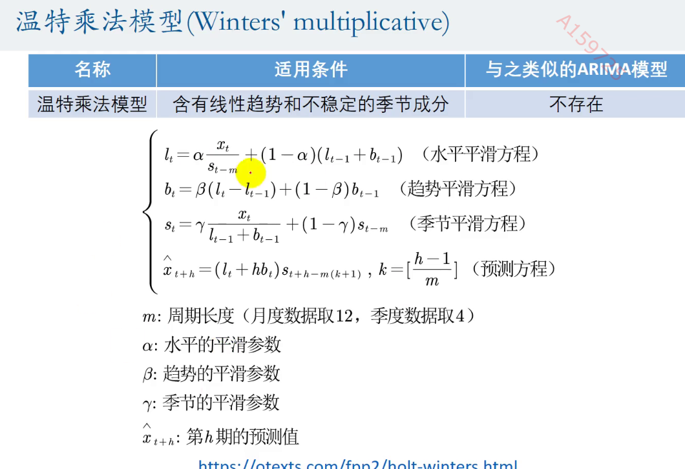
### 模型参数解释
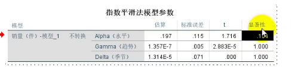
t:统计量   
显著性：p  

## ARIMA
时间序列${x_t}$为协方差平稳或若平稳  iff  
$\begin{cases}
E(x_t)=E(x_{t-1})=u  （均值为固定常数）    
\\
Var(x_t)=Var(x_{t-s})=\sigma^2  （方差为固定常数）
\\
Cov(x_t,x_{t-s}=\gamma_s)  （协方差只与间隔s有关，与t无关）
\end{cases}$  

平稳性一般为弱平稳
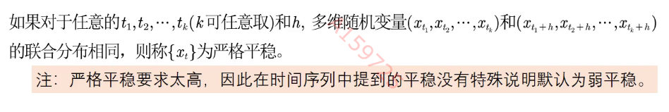  

白噪声序列(扰动项)
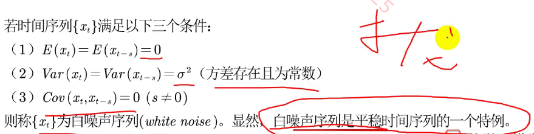  

差分方程
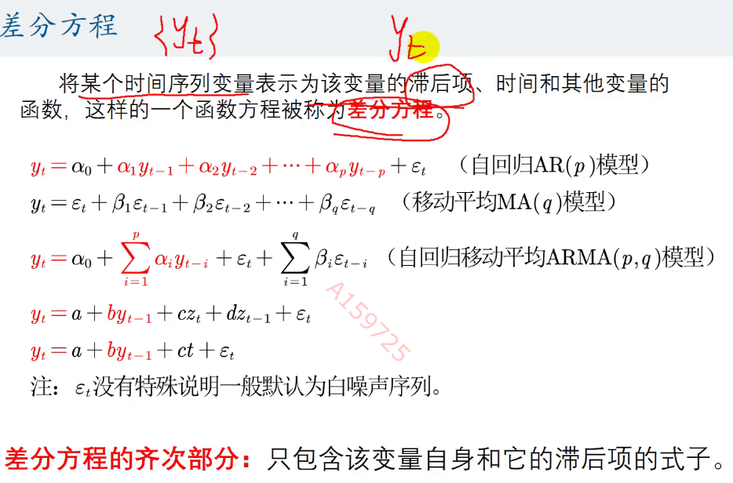  

滞后算子  

$\begin{cases}  
L_iy_t=y_{t-i} 
\\
L_iL_jy_t=y_{t-i-j}  
\\
(L_i+L_j)y_t=y_{t-i}+y_{t-j}  
\\
LC=C
\end{cases}$  

ARMA模型  
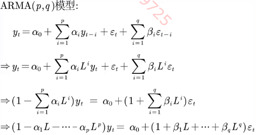  
差分  
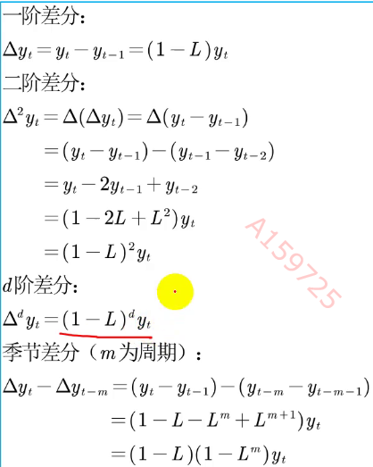  

AR(p)自回归模型  
适用于受自身历史因素影响较大的现象  
一定要先转化为平稳的时间序列（通过差分）
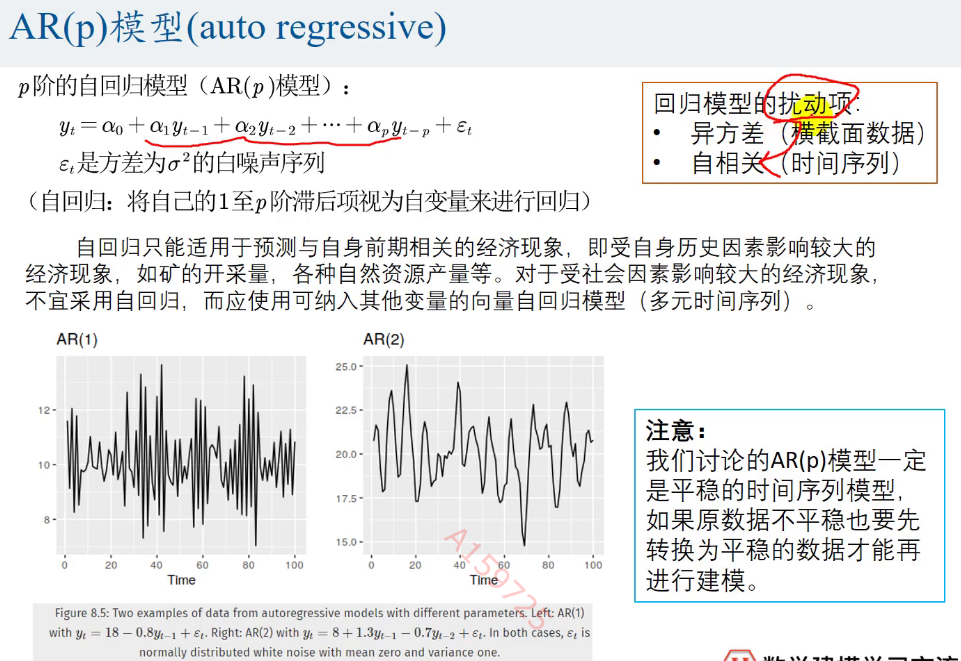  

AR(p)平稳条件  
$y_t=\alpha_0+\alpha_1y_{t-1}+\cdots+\alpha_py_{t-p}+\varepsilon_t$  
$\varepsilon_t$为方差为$\sigma^2$的白噪声序列（平稳时间序列）  
自回归：将1-p阶滞后项视作自变量来回归  

将齐次部分转化为特征方程：  
$x^p=\alpha_1x^{p-1}+\alpha_2 x^{p-1}+\cdots+\alpha_p$  
该特征方程为n阶多项式，可求出p个解  

1. 若p个解模长均小于1，则{y_t}平稳，对应的AR(p)模型平稳 
2. 若p个解中有k个解模长等于1，则{y_t}为k阶单位根过程，k个解经过差分过程将{y_t}转化为平稳时间序列  
3. 若p个解中有解模长大于1，则称{y_t}为爆炸过程  

例如，对于$y_p=\alpha_0 + \alpha_1y_{t-1}, \alpha_1>1, \alpha_0=0$, 特征方程为$x^p=\alpha_1x^{p-1}$,由于$\alpha>1$, 故存在模长大于1的根，该时间序列{y_t}指数增长  

差分变形：  
几阶单位根过程，就进行几阶差分  
  
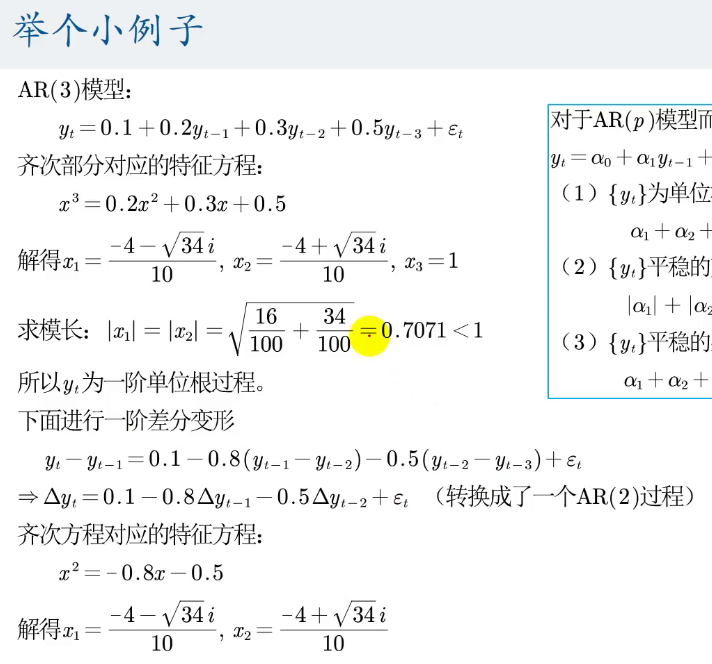  
平稳性：  
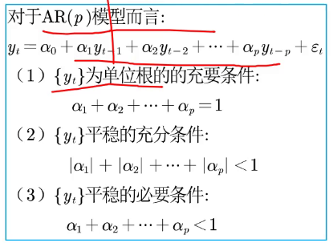  

## MA(q)移动平均模型
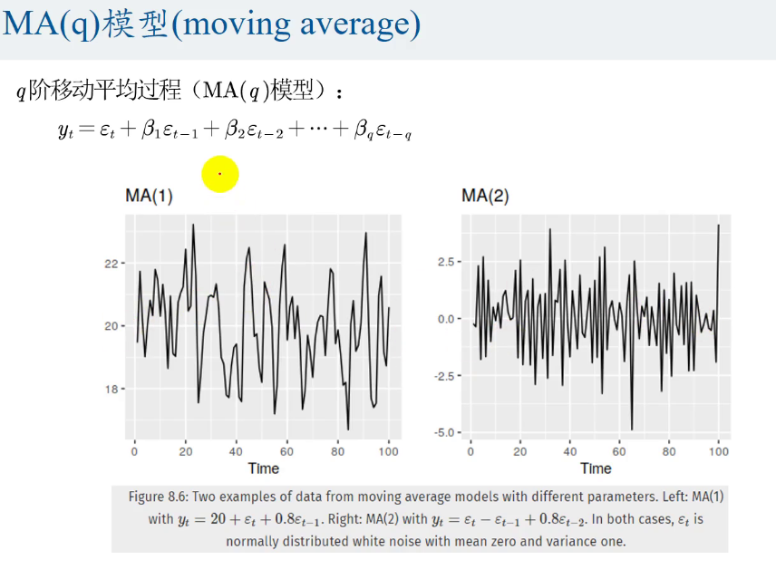  
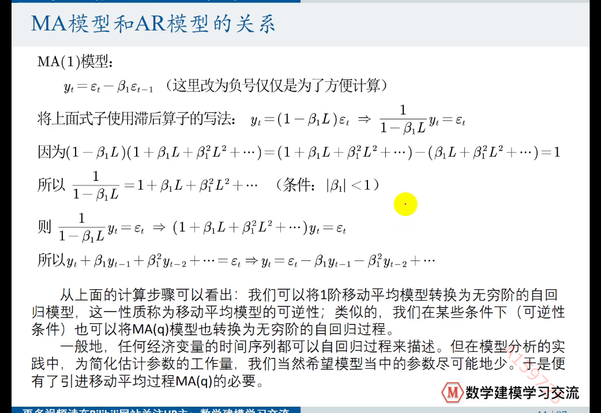
## ARMA 模型
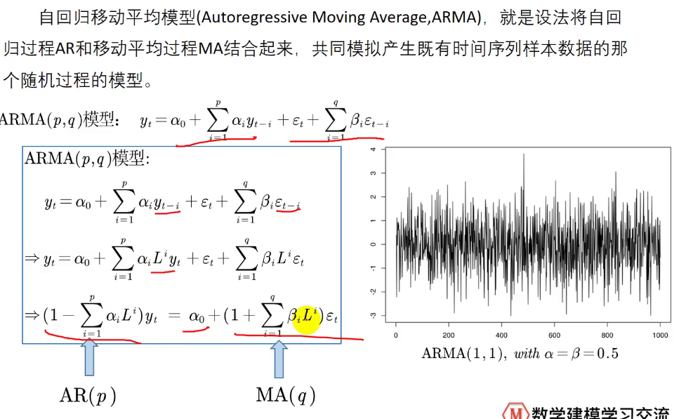  
ARMA模型的平稳性只与自回归AR(p)部分有关   

ARMA模型平稳性检验方法：  
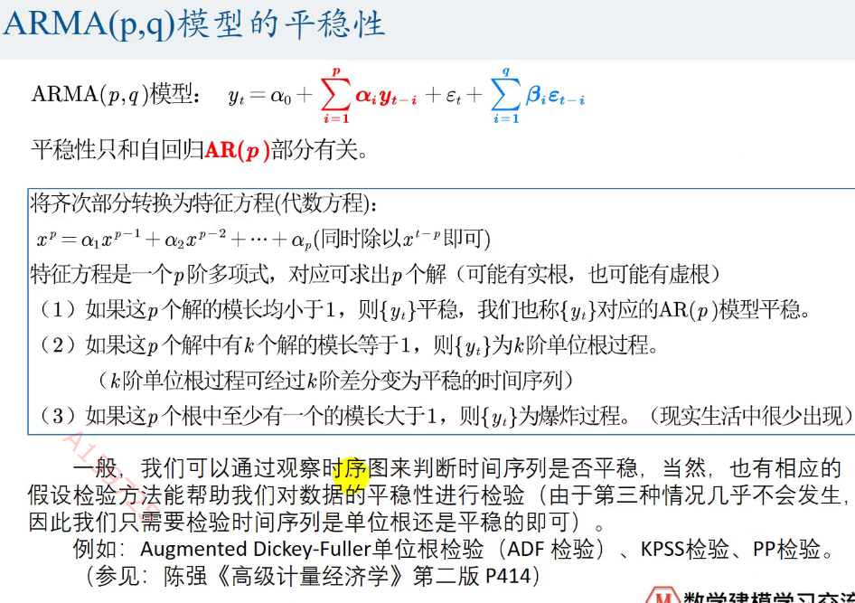

ACF自相关系数:  
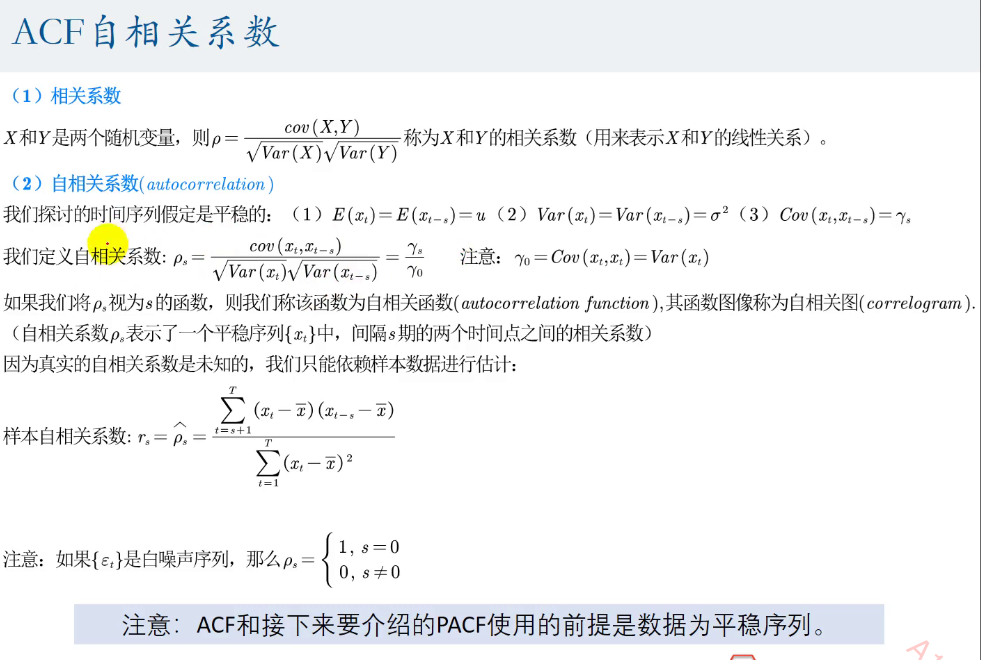

偏自相关系数PACF： 
$x_i$与$x_j$剔除中间时间点影响求得的相关系数 
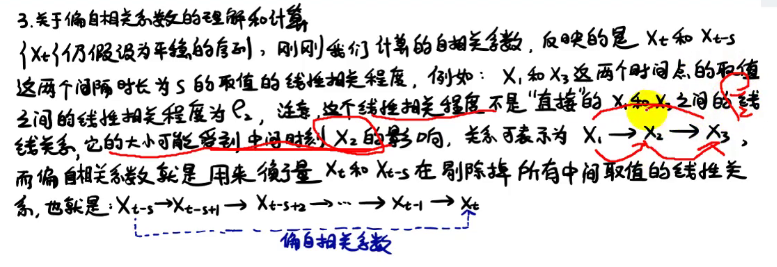  
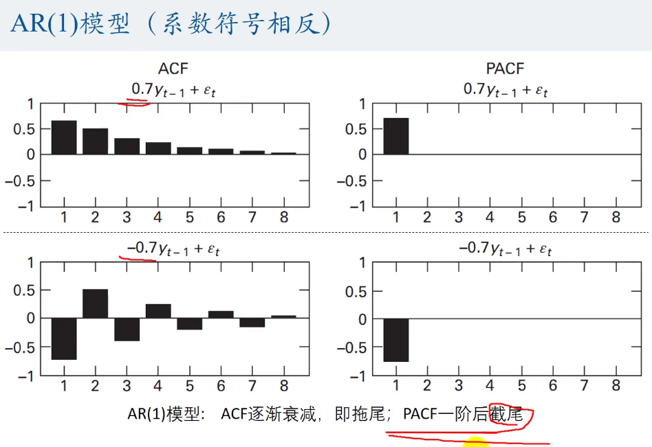  

AR(p),MA(p)与ARMA模型的ACF与PACF：
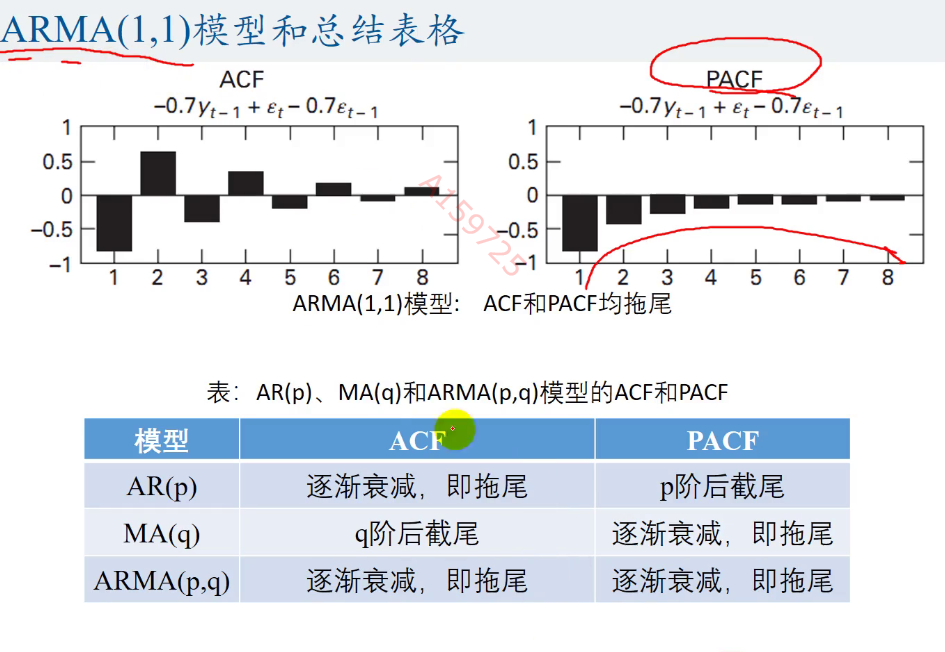  

