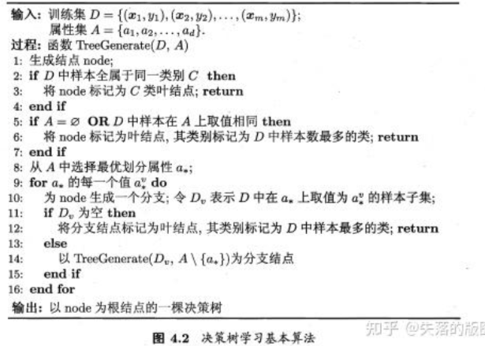

# Mathematics Modeling Note C-6  
## 随机森林算法
***机器学习中的两种任务：分类与回归***  
***回归是对连续值进行预测***   
***分类是对离散值进行预测***   
***随机森林算法两种任务都可以完成***   
***随机森林算法是一种机器学习算法***   

基本思想：集成多个分类器  
集成学习：将多个分类器组合以实现预测效果更好的集成分类器  
集成算法：Bagging，Boosting，Stacking  
其中随机森林算法采用Bagging的思想，以决策树为基本单元，通过集成大量决策树构成随机森林  

### Bagging：
1. 每次有放回地从训练集中取出 n 个训练样本，组成新的训练集；

2. 利用新的训练集，训练得到M个子模型；

3. 对于分类问题，采用投票的方法，得票最多子模型的分类类别为最终的类别；  
4. 对于回归问题，采用简单的平均方法得到预测值。  

树的构建：样本与特征  
样本：在训练集T中有N个样本，有放回地随机选择N个样本（可能选不够N个样本）作为决策树节点处样本  
特征：在d个特征中选择k（k << d）个特征  

每个样本有d个属性，当决策树节点需要分裂是，随机从d个属性中选取出k个属性，然后采用某种策略选出一个属性作为该节点的分裂属性  

算法流程：  

信息熵：度量样本集合纯度的指标  
$Ent(D)=-\sum_{k=1}^{|y|}p_klog_2p_k$,D为样本集合，k为第k类样本，$p_k$为第k类样本所占比例。Ent(D)越小，D的纯度越高  

决策树的分类特征选择指标：