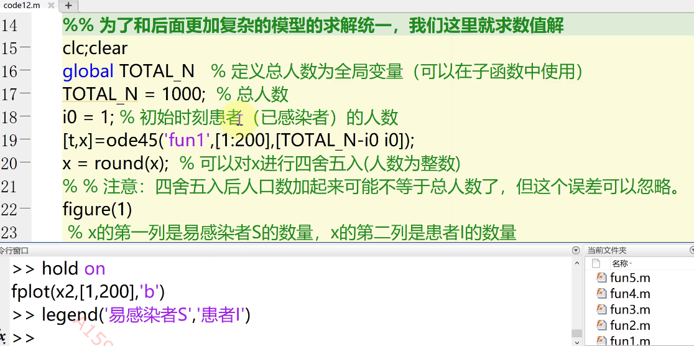

# Mathematics Modeling Note C-7
S(susceptible):易感者  
E(Exposed):潜伏者  
I(Infected):感染者  
R(Recovered):康复者  
## SI模型
N:总人口，N=S+I  
$\beta$:易感者与已感染者接触并被传染的强度  
S转化为I的人数：$\beta\frac{S}{N}\times\frac{I}{N}\times N=\beta\frac{SI}{N}$  
故有$S(t+\Delta t)-S(t)=-\beta\frac{S(t)I(t)}{N}\Delta t$  
$I(t+\Delta t)-I(t)=\beta\frac{S(t)I(t)}{N}\Delta t$  
即对应的微分方程组为：$\begin{cases}
\frac{dS}{dt}=-\beta\frac{SI}{N}
\\
\frac{dI}{dt}=\beta\frac{SI}{N} 
\end{cases}$  
直接求解析解求不出来，求数值解  
求解微分方程，得到的是一个表达式，绘图用fplot(x1,[1,200], 'r')('r'表示红色)  
这是间接求解析解的方法：  
  

数值解：  
  
[t, x]=ode45()  
**In func.m:**  
  
绘图：  

## SIS模型
设I->S恢复率$\alpha$  

$\begin{cases}
\frac{dS}{dt}=\alpha I-\beta\frac{S\times I}{N}
\\
\frac{dI}{dt}=\beta\frac{S\times I}{N}-\alpha I
\end{cases}$  

SIS模型拓展：  
（1）考虑使得$\alpha$增加因素：增加新的医疗装备  
（2）增加人口出生率、自然死亡率和因病死亡率  
（3）一部分人恢复后产生抗体，一部分人没有  
## SIR模型
## SIRS模型
## SERS模型
  
