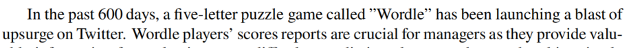

### 
传染病模型，随机森林算法，时序算法，F分布（统计量？）   

### 标题
crack the wordle puzzle  
revitalizing a classic game  

### sentenecs

### 2301192（英文写作能力强）  
crack the wordle puzzle  
把SRIS模型与wordle game类比  
data oscillations数据振荡  
prediction interval预测区间  
interpretability可解释性  
corpus语料库  
extract取出   
clustering分类
breadth of the usage of the word广度
boost the appealing feature  
F分布（统计量？）